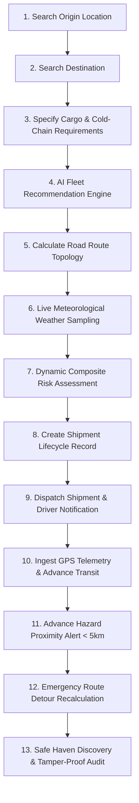

# AuraNER / NER-RouteAI — Production-Grade Logistics, Dispatch & Dynamic Route Safety System

[](https://nextjs.org)
[](https://www.typescriptlang.org)
[](https://vitest.dev)
[](https://postgis.net)
[](#geographic-coverage)

**AuraNER / NER-RouteAI** is an enterprise logistics intelligence, dispatch management, and dynamic route safety platform engineered specifically for **India's Northeast Region (NER)**—covering Assam, Arunachal Pradesh, Manipur, Meghalaya, Mizoram, Nagaland, Tripura, and Sikkim.

Unlike static logistics demos, NER-RouteAI executes a **complete, verified, 13-step operational workflow** backed by real geospatial algorithms, meteorological overlays, PostGIS spatial indexing, multi-tier emergency hazard escalation, and hardware-accelerated vector mapping.

---

## 🗺️ The Complete 13-Step Operational Workflow

The system guarantees and automates the complete lifecycle:



### 100% Automated Test Verification
Run the end-to-end verification scenario testing all 13 steps simultaneously:
```bash
npm test
```
**Result**: `13/13 Steps Passed (0 Failed) in 9.99s`.

---

## 🏛️ System Architecture

```
┌─────────────────────────────────────────────────────────────────────────────┐
│                             CLIENT INTERFACES                                │
│  ┌───────────────────────┐  ┌──────────────────────┐  ┌───────────────────┐  │
│  │ Dispatch Radar Center │  │ 7-Step Wizard        │  │ Driver Mobile PWA │  │
│  │ (/dispatch)           │  │ (/dispatch/new)      │  │ (/driver)         │  │
│  └───────────────────────┘  └──────────────────────┘  └───────────────────┘  │
│                         MapLibre GL Vector Engine                            │
└──────────────────────────────────────┬──────────────────────────────────────┘
                                       │ REST / JSON
┌──────────────────────────────────────▼──────────────────────────────────────┐
│                            V1 PRODUCTION APIS                                │
│   /api/v1/search             /api/v1/vehicles/recommend   /api/v1/shipments  │
│   /api/v1/routes/plan        /api/v1/routes/recalculate   /api/v1/dispatch   │
│   /api/v1/incidents          /api/v1/alerts               /api/v1/telemetry  │
└──────────────────────────────────────┬──────────────────────────────────────┘
                                       │
┌──────────────────────────────────────▼──────────────────────────────────────┐
│                        LOGISTICS & SAFETY SERVICES                           │
│  ┌──────────────────────┐  ┌──────────────────────┐  ┌────────────────────┐  │
│  │ Vehicle Service      │  │ Dynamic Risk Scanner │  │ Recalculation Svc  │  │
│  │ (Gradients & Widths) │  │ (<5km Hazard Alert)  │  │ (Detour Generator) │  │
│  └──────────────────────┘  └──────────────────────┘  └────────────────────┘  │
│  ┌──────────────────────┐  ┌──────────────────────┐  ┌────────────────────┐  │
│  │ Alert Escalation Svc │  │ Safe Location Finder │  │ Immutable Audit    │  │
│  │ (Driver/Dispatch/Cmd)│  │ (Police/Hospital/Camp│  │ Trail Service      │  │
│  └──────────────────────┘  └──────────────────────┘  └────────────────────┘  │
└──────────────────────────────────────┬──────────────────────────────────────┘
                                       │
┌──────────────────────────────────────▼──────────────────────────────────────┐
│                           EXTERNAL PROVIDERS                                 │
│   Nominatim + NER GIS   ·   OSRM Engine   ·   Open-Meteo   ·   Multi-Channel │
└──────────────────────────────────────┬──────────────────────────────────────┘
                                       │
┌──────────────────────────────────────▼──────────────────────────────────────┐
│                    PERSISTENCE (Dual Mode Resilient)                         │
│   PostgreSQL + PostGIS (Production)   ·   In-Memory High-Speed Cache (Local) │
└─────────────────────────────────────────────────────────────────────────────┘
```

---

## 📍 Geographic Coverage & Elevation Modeling

The system models all 8 Northeast India states with realistic elevation and road accessibility tiers:

| State | Reference Hubs Included | Max Elevation | Road Quality Classifications |
| :--- | :--- | :--- | :--- |
| **Assam** | Guwahati, Tezpur, Silchar, Jorhat, Dibrugarh | 116m | `ALL_WEATHER` National Highways |
| **Arunachal Pradesh** | Itanagar, Bomdila, Tawang, Pasighat, Ziro | 3048m | `RESTRICTED`, `FAIR_WEATHER`, High Mountain Passes |
| **Nagaland** | Kohima, Dimapur, Mokokchung | 1444m | `ALL_WEATHER`, Active Landslide Corridors |
| **Manipur** | Imphal, Churachandpur, Senapati, Karong | 1680m | `ALL_WEATHER`, `4X4_ONLY` Outposts |
| **Meghalaya** | Shillong, Tura, Cherrapunji | 1496m | Highland Ridge, Heavy Precipitation Corridors |
| **Mizoram** | Aizawl, Lunglei | 1133m | Ridge Routes, Single-Lane Mountain Access |
| **Tripura** | Agartala, Udaipur | 13m | Plain & River Basin Corridors |
| **Sikkim** | Gangtok, Mangan | 1650m | Himalayan River Valley (Teesta), Flood Corridors |

---

## 🗄️ Database Architecture (PostgreSQL + PostGIS)

The core relational and spatial schema is defined in `supabase/migrations/0001_init.sql` and initialized with `supabase/seed/dev.sql`:

- **Extensions**: `uuid-ossp`, `postgis`
- **Core Domain Tables**:
  - `organizations` — Logistics carriers and government disaster relief agencies
  - `users` — 7 RBAC roles (`super_admin`, `admin`, `dispatcher`, `driver`, `operator`, `officer`, `viewer`)
  - `vehicles` — Fleet models with maximum gradient limits (`max_gradient_pct`), road width (`max_width_meters`), water crossing capability, payload capacity (`capacity_kg`), volume (`volume_m3`), and active GPS point geometry
  - `locations` — 29 reference hubs with PostGIS `GEOGRAPHY(Point, 4326)`, elevation, and accessibility tiers
  - `shipments` — Full lifecycle tracking (`DRAFT` → `PLANNED` → `ASSIGNED` → `DISPATCHED` → `IN_TRANSIT` → `REROUTING` → `DELIVERED`)
  - `routes` & `route_segments` — PostGIS LineString geometry, terrain classification, elevation gain, road condition scores, landslide/flood risk scores
  - `incidents` — 16 hazard types (Landslide, Flood, Road Block, Bridge Failure, Rockfall, etc.) with coordinates, affected radius, confidence, and source
  - `alerts` — Multi-tier escalation timestamps (`acknowledged_at`, `escalated_at`, `resolved_at`)
  - `telemetry` — Live streaming GPS breadcrumbs with speed, heading degrees, altitude, and accuracy
  - `safe_locations` — Designated emergency havens (Police Posts, Hospitals, Relief Camps, Fuel Depots)
  - `audit_logs` — Immutable, tamper-proof audit trail

---

## 🚀 Production V1 API Reference

All APIs adhere to the standardized response envelope:
`{ success: boolean, data: T, error?: { code, message, details }, meta?: Record<string, unknown> }`

### Location Intelligence
- `GET /api/v1/search?q={query}&state={state}&limit={limit}`
  - Searches Northeast locations using Nominatim with fallback to the NER offline geographic dictionary. Returns elevation, accessibility tier, and road quality.

### Fleet Suitability Recommendation
- `POST /api/v1/vehicles/recommend`
  - Evaluates fleet against payload weight, volume, destination mountain gradient, and cold-chain constraints. Returns ranked vehicles with explainable compatibility scores.

### Multi-Criteria Road Routing
- `POST /api/v1/routes/plan`
  - Calculates road geometry via OSRM, evaluates road segments against vehicle parameters, and samples meteorological weather along the route via Open-Meteo.

### Shipment Management
- `GET /api/v1/shipments?status={status}` — Query active shipments.
- `POST /api/v1/shipments` — Create shipment lifecycle record.

### Dispatch Execution
- `GET /api/v1/dispatch?vehicle_id={id}&status={status}` — Query active dispatches.
- `POST /api/v1/dispatch` — Binds vehicle, driver, and route geometry, sets status to `DISPATCHED`, logs audit event, and broadcasts driver mobile notification.

### Hazard & Incident Reporting
- `GET /api/v1/incidents?status=ACTIVE&lat={lat}&lng={lng}&radius_km={radius}` — Spatial proximity query for active hazards.
- `POST /api/v1/incidents` — Report new hazard with severity, coordinates, confidence, and affected radius.

### Real-Time Alerts & Escalation
- `GET /api/v1/alerts?shipment_id={id}&status=ACTIVE` — Query active alerts.
- `POST /api/v1/alerts` — Acknowledge, escalate, resolve, or trigger route alerts.

### High-Throughput GPS Telemetry
- `GET /api/v1/telemetry?vehicle_id={id}&history=true` — Get latest position or breadcrumbs trail.
- `POST /api/v1/telemetry` — Ingest streaming GPS pings. Auto-advances shipment status to `IN_TRANSIT`.

### Emergency Route Recalculation
- `POST /api/v1/routes/recalculate`
  - Generates safe detour geometry bypassing active hazard coordinates, verifies vehicle compatibility, computes ETA impact, and identifies the 3 nearest emergency safe havens.

---

## 💻 Getting Started & Running Locally

### 1. Prerequisites
- Node.js 18.17+ or 20+
- npm 9+

### 2. Installation
```bash
git clone <repo-url> ne-routeai-next
cd ne-routeai-next
npm install
```

### 3. Environment Setup
Copy the production environment template:
```bash
cp .env.example .env.local
```
*(The system operates with full dual-mode resilience: even without active Supabase credentials, the local high-speed in-memory store and verified seed data are used automatically).*

### 4. Run Automated Verification Test Suite
```bash
npm test
```

### 5. Start Development Server
```bash
npm run dev
```
Open [http://localhost:3000](http://localhost:3000) in your browser:
- **Dispatch Command Center**: `/dispatch`
- **7-Step Dispatch Wizard**: `/dispatch/new`
- **Driver Mobile View**: `/driver`
- **Smart Route AI**: `/routes`
- **Risk Intelligence**: `/risk`

### 6. Production Build
```bash
npm run build
npm start
```

---

## 🛡️ Security, RBAC & Compliance

- **Security Headers**: Injected in `next.config.js` (`X-Frame-Options: DENY`, `X-Content-Type-Options: nosniff`, `Referrer-Policy: strict-origin-when-cross-origin`, `Permissions-Policy` with authorized geolocation).
- **Authentication**: Dual Supabase Auth + JWT fallback with 60-second cooldown rate limiting on OTP verification.
- **Role-Based Access Control**: Strict role checks across 7 tiers (`super_admin`, `admin`, `dispatcher`, `driver`, `operator`, `officer`, `viewer`).
- **Audit Logging**: Every shipment creation, dispatch, route recalculation, and alert acknowledgment writes an immutable audit record to the `audit_logs` table.

---

## 📄 License
Production enterprise software designed for the Government of India, State Logistics Departments, Disaster Management Authorities (NDRF/SDMA), and Border Roads Organisation (BRO). All rights reserved.
