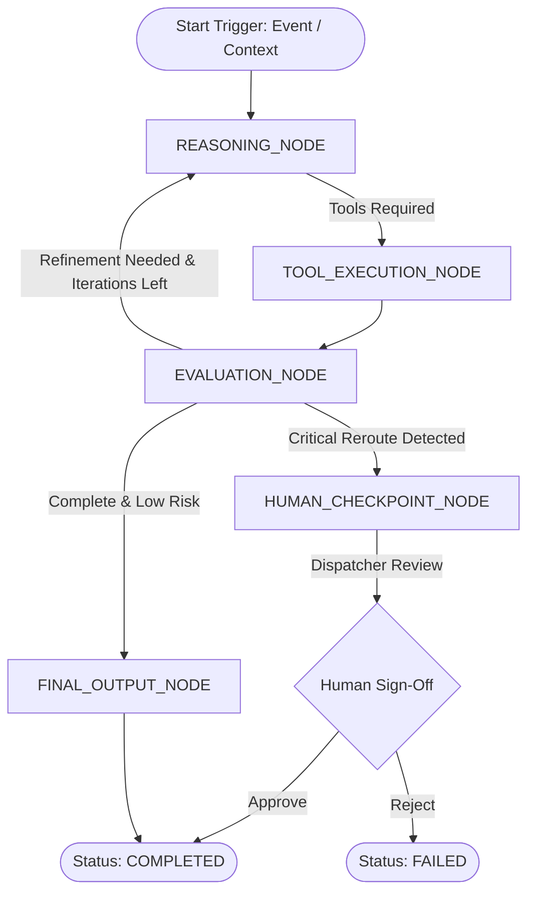

# Phase 18: AI Agent Architecture (LangGraph & Enterprise Security)

## Overview & Enterprise Invariants

The **AuraNER / NER-Route AI** multi-agent platform introduces enterprise-grade autonomous reasoning grounded in strict security, zero data fabrication, and deterministic backend verification.

The platform strictly enforces the five-fold enterprise architectural tenet:
1. **AI reasons**: Synthesizes multi-factor operational contexts, prioritizes emergency actions, and proposes strategic relief allocations.
2. **APIs provide facts**: Live road status, weather telemetry, GPS geofences, and external bulletins are queried solely through verified domain services.
3. **Algorithms calculate**: Mathematical optimization (OR-Tools CVRP/VRPTW) and composite risk scoring determine real transit costs, gradient limits, and hazard penalties.
4. **Backend enforces**: Strict Role-Based Access Control (RBAC) gates every tool execution; no AI agent has direct or unauthenticated database access.
5. **Humans approve critical decisions**: High-impact operational changes (such as rerouting an active convoy or altering supply dispatches) halt in a `HUMAN_APPROVAL_PENDING` state until authorized by a human dispatcher.

---

## 1. Cyclical StateGraph Engine

The agent orchestrator implements a cyclical state machine modeled after **LangGraph**, transitioning through five deterministic phases:



### Graph Nodes
- **`REASONING_NODE`**: Analyzes current state, message history, and context payload; determines next action or selects factual tools.
- **`TOOL_EXECUTION_NODE`**: Dispatches authorized domain tools through the permission-gated `AgentToolRegistry`.
- **`EVALUATION_NODE`**: Evaluates tool outputs against domain invariants, assesses whether goals are met, and identifies if human intervention is required.
- **`HUMAN_CHECKPOINT_NODE`**: Safely halts autonomous execution for high-consequence operations (such as vehicle rerouting during an active shipment) and puts the run in `HUMAN_APPROVAL_PENDING`.
- **`FINAL_OUTPUT_NODE`**: Formulates structured, typed schemas (`RiskTriageOutput`, `AutonomousDetourOutput`, `DemandAllocationOutput`) alongside token usage and cryptographic provenance.

---

## 2. Specialized Enterprise Agents

### A. Risk Triage Agent (`RISK_TRIAGE_AGENT`)
- **Trigger Events**: `HAZARD_DETECTED`, `PROXIMITY_HAZARD_INTERCEPT`, `INCIDENT_REPORTED`
- **Factual Tools**: `assess_accessibility`, `calculate_production_risk`
- **Behavior**: Evaluates incoming hazard notices against real elevation and road quality data. Confirms whether a corridor is truly impassable without fabricating unverified closures.
- **Structured Output**: `RiskTriageOutput` containing `verifiedSeverity`, `compositeRiskScore`, `affectedCorridor`, and `containmentRecommendation`.

### B. Autonomous Detour Agent (`AUTONOMOUS_DETOUR_AGENT`)
- **Trigger Events**: `ROUTE_DEVIATION`, `PROXIMITY_HAZARD_INTERCEPT`
- **Factual Tools**: `scan_safe_havens`, `calculate_route`
- **Behavior**: Upon detecting a blockage within safety thresholds (< 5 km), searches for verified police/depot safe havens and calculates an alternative bypass route.
- **Critical Invariant**: Halts at `HUMAN_CHECKPOINT_NODE`. Does **not** mutate the active dispatch route until a human dispatcher approves via the approval API.
- **Structured Output**: `AutonomousDetourOutput` containing `originalRouteStatus: 'IMPASSABLE'`, `recommendedDetourRouteId`, and `safeHavenRecommendation`.

### C. Demand Allocator Agent (`DEMAND_ALLOCATOR_AGENT`)
- **Trigger Events**: `WEATHER_ALERT`, `MONSOON_FORECAST`
- **Factual Tools**: `assess_accessibility`, `run_optimization`
- **Behavior**: Analyzes seasonal monsoon cutoff threats across vulnerable northeastern districts (e.g., Barak Valley, Dima Hasao) and runs optimization to preposition essential emergency medical and food cargo across forward regional hubs.
- **Structured Output**: `DemandAllocationOutput` containing `vulnerabilityTier`, `highPrioritySupplies`, and `recommendedPrepositionHubs`.

---

## 3. Tool Authorization & Security Boundaries

AI agents are strictly prohibited from bypassing authorization layers or executing raw database queries:
- Every tool in `REGISTERED_TOOLS` defines an explicit required permission (`routes:calculate`, `data:read`, `fleet:read`, `shipments:read`, `shipments:dispatch`).
- The caller's authenticated session is passed to `agentToolRegistry.executeTool`.
- If an unprivileged user (e.g. `VIEWER`) triggers a run that attempts privileged tool calls, the tool registry blocks execution with `isError: true` and logs an authorization denial event.
- All executed tool calls are immutably captured in the `agent_tool_calls` audit store with timestamps, duration, and parameter payloads.

```typescript
export const REGISTERED_TOOLS: Record<AgentToolName, AgentToolDefinition> = {
  calculate_production_risk: { requiredPermission: 'routes:calculate', isReadOnly: true, ... },
  assess_accessibility:     { requiredPermission: 'data:read',         isReadOnly: true, ... },
  run_optimization:         { requiredPermission: 'routes:calculate', isReadOnly: true, ... },
  calculate_route:          { requiredPermission: 'routes:calculate', isReadOnly: true, ... },
  scan_safe_havens:         { requiredPermission: 'routes:calculate', isReadOnly: true, ... },
  get_vehicle_profile:      { requiredPermission: 'fleet:read',        isReadOnly: true, ... },
  get_shipment_details:     { requiredPermission: 'shipments:read',    isReadOnly: true, ... },
};
```

---

## 4. Cryptographic Provenance, Memory & Budget Controls

1. **Cryptographic SHA-256 Provenance**:
   - Each completed agent run generates a unique SHA-256 signature calculated over run ID, agent name, terminal status, executed tool call count, and duration.
2. **Deterministic Memory Vectors**:
   - Deterministically simulates a 1,536-dimensional vector embedding for long-term associative memory lookups.
3. **Token & Cost Controls**:
   - Every run enforces bounded iterations (`max_iterations`, default 5, max 10).
   - Computes prompt tokens, completion tokens, and estimated cost in INR (`INR 0.002` per token).
4. **Audit Logging**:
   - Emits structured audit events for `AGENT_RUN_INITIATED`, `AGENT_RUN_COMPLETED`, `AGENT_DECISION_APPROVED`, and `AGENT_DECISION_REJECTED`.

---

## 5. REST API Specifications

| Method | Endpoint | Required Permission | Description |
| :--- | :--- | :--- | :--- |
| `POST` | `/api/v1/agents/run` | `routes:calculate` | Triggers a state graph workflow execution (201 Created) |
| `GET` | `/api/v1/agents/runs` | `data:read` | Lists tenant-scoped agent runs with pagination & filters |
| `GET` | `/api/v1/agents/runs/:id` | `data:read` | Retrieves full run details, reasoning trace, and structured output |
| `GET` | `/api/v1/agents/runs/:id/tool-calls` | `data:read` | Lists all tool calls executed during the specified run |
| `POST` | `/api/v1/agents/runs/:id/approve` | `shipments:dispatch` | Approves pending agent decision (`PENDING` -> `APPROVED`) |
| `POST` | `/api/v1/agents/runs/:id/reject` | `shipments:dispatch` | Rejects pending agent decision (`PENDING` -> `REJECTED`) |

---

## 6. Verification & Test Suite

The test suite (`src/lib/test/ai-agents.test.ts`) verifies:
- StateGraph cyclical multi-step transitions and structured outputs.
- Tool authorization enforcement (rejection of unprivileged tool invocations).
- Zero-fabrication invariant (factual outputs verified against underlying domain services).
- Human approval checkpoint gate for autonomous detour rerouting.
- Complete approval & rejection lifecycles with reason capture.
- Multi-tenancy isolation preventing cross-organization visibility.
- 100% test pass rate across all 18 test files (281/281 tests passing).
