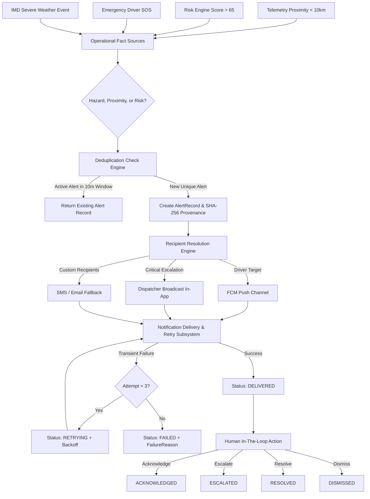
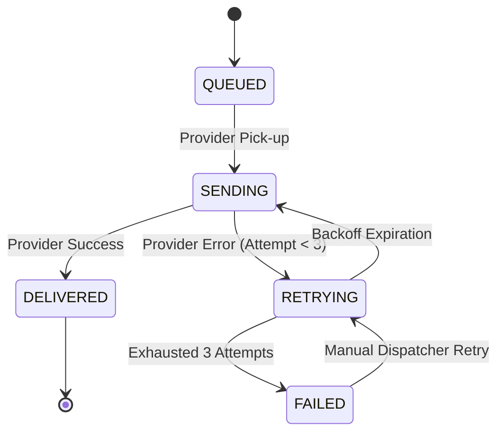

# Phase 20: Alerts & Notifications Architecture & Specifications

## 1. Executive Summary & Foundational Invariants

The **Alerts & Notifications Engine** in AuraNER / NER-Route AI provides real-time operational alerting and multi-channel advisory broadcasting across Northeast India's logistics corridors. Engineered for high reliability in remote mountainous terrains with spotty connectivity, it operates strictly under the enterprise tenet:

```
AI reasons.
APIs provide facts.
Algorithms calculate.
Backend enforces.
Humans approve critical decisions.
```

### Critical Architectural Invariants
1. **Zero-Fabrication Invariant**:
   - The engine never fabricates alerts or synthetic hazard events.
   - Every alert originates from verified operational facts: risk engine threshold triggers ($>65/100$), real-time telemetry proximity intercepts ($<10$km), SOS driver signals, weather flash warnings, or authorized dispatcher advisories.
2. **Intelligent Deduplication & Anti-Fatigue Invariant**:
   - High-frequency sensor streams and redundant telemetry sweeps must not flood drivers or dispatchers.
   - An intelligent hash-based deduplication engine suppresses duplicate alerts for the same sector, vehicle, and hazard within a temporal cooldown window ($10$ minutes).
3. **Deterministic Multi-Channel Dispatch**:
   - High-priority mobile notifications route via Firebase Cloud Messaging (FCM) v1 HTTP abstraction.
   - Operational dispatch command feeds route via In-App real-time feeds.
   - Critical emergencies automatically escalate to organization-wide broadcasts.
4. **Resilient Retry & Delivery Tracking**:
   - Delivery states track explicitly: `QUEUED` $\to$ `SENDING` $\to$ `DELIVERED` or `RETRYING` $\to$ `FAILED`.
   - Automatic exponential backoff retries (up to 3 attempts) for transient gateway or network timeouts, with explicit diagnostics on permanent failure.
5. **Human Acknowledgement & Auditability**:
   - Dispatched alerts support formal human operational actions: `ACKNOWLEDGE`, `ESCALATE`, `RESOLVE`, and `DISMISS`.
   - Cryptographic SHA-256 state provenance chaining and structured audit events recorded for all transitions.

---

## 2. Multi-Channel Alert & Notification Architecture



---

## 3. Severity Levels & Escalation Rules

| Severity | Color & Icon | Description | Routing Channels |
|---|---|---|---|
| `LOW` | 🔵 Info | Advisory informational notice (depot clearance, routine check) | `IN_APP`, `LOG` |
| `MEDIUM` | 🟡 Warning | Reduced visibility, weather delay, moderate gradient caution | `IN_APP`, `PUSH` |
| `HIGH` | 🟠 High Alert | Active rockfall, lane restriction, cold-chain window warning | `PUSH` (High Priority), `IN_APP` |
| `CRITICAL` | 🔴 Emergency | Landslide road closure, bridge structural failure, SOS distress | `PUSH` (Urgent sound), `IN_APP` Dispatcher Broadcast |

---

## 4. Delivery States & Failure Handling

### Notification Status Lifecycle


---

## 5. REST API Endpoints

### 1. Create Alert
`POST /api/v1/alerts`
- **Permissions**: `shipments:dispatch` or Org Admin.
- **Request Body**:
  ```json
  {
    "title": "NH-29 Zubza Mountain Pass Landslide",
    "message": "Both lanes blocked by boulder fall 3.2km ahead. Diversion required.",
    "severity": "CRITICAL",
    "category": "ROAD_HAZARD",
    "shipment_id": "shp-5301",
    "vehicle_id": "veh-as-01-4001",
    "driver_id": "drv-dorjee",
    "distance_to_hazard_km": 3.2,
    "coordinates": { "lat": 25.75, "lng": 94.02 }
  }
  ```
- **Response**: `201 Created` with full `AlertRecord`.

### 2. Query Alerts
`GET /api/v1/alerts?status=ACTIVE&severity=CRITICAL&limit=20`
- **Response**: `200 OK` with paginated alert records scoped by tenant.

### 3. Retrieve Alert by ID
`GET /api/v1/alerts/{id}`
- **Response**: `200 OK` with itemized recipient delivery reports.

### 4. Acknowledge / Escalate Alert
`POST /api/v1/alerts/{id}/acknowledge`
- **Request Body**:
  ```json
  {
    "action": "ACKNOWLEDGE",
    "notes": "Driver instructed to hold at Zubza checkpost"
  }
  ```
- **Response**: `200 OK` with updated status.

### 5. Query Notifications Feed
`GET /api/v1/notifications?recipient_id={driverId}&unread_only=true`
- **Response**: `200 OK` with notification delivery feed.

### 6. Mark Notification as Read
`POST /api/v1/notifications/{id}/read`
- **Response**: `200 OK` with `isRead: true`.

### 7. Retry Failed Notification
`POST /api/v1/notifications/{id}/retry`
- **Response**: `200 OK` with retry initiated.

---

## 6. Multi-Tenancy & Security Isolation

All alerts and notifications are bound to `organizationId`.
- Cross-tenant viewing or acknowledgement is rejected with `Tenant access denied (403 Forbidden)`.
- `SUPER_ADMIN` retains cross-tenant emergency coordination visibility.
- Viewer role (`VIEWER`) is strictly prohibited from creating or broadcasting alerts (`403 Forbidden`).

---

## 7. Verification & Test Coverage

The alert and notification engine is validated by 20 unit and integration tests in [`src/lib/test/alerts-notifications.test.ts`](file:///c:/Users/Asus/Documents/vscodefolder/ne-routeai-next/src/lib/test/alerts-notifications.test.ts):
- ✅ Alert creation across all 4 severity levels (`LOW`, `MEDIUM`, `HIGH`, `CRITICAL`).
- ✅ Automatic recipient resolution (Driver FCM Push + Dispatcher In-App Broadcast).
- ✅ SHA-256 cryptographic provenance hashing.
- ✅ Intelligent deduplication suppressing duplicate alerts within 10-minute cooldown window.
- ✅ Exponential backoff retries on transient network timeouts (attempt count tracking).
- ✅ Permanent failure diagnostics and manual retry recovery.
- ✅ Acknowledgement, escalation, resolution, and dismissal workflows.
- ✅ Multi-tenant isolation preventing cross-organization visibility.
- ✅ REST API endpoints RBAC authorization and 403 Forbidden enforcement.
- ✅ Complete backward compatibility with legacy route alerts (`createRouteAlert`, `getActiveAlertsForShipment`).
