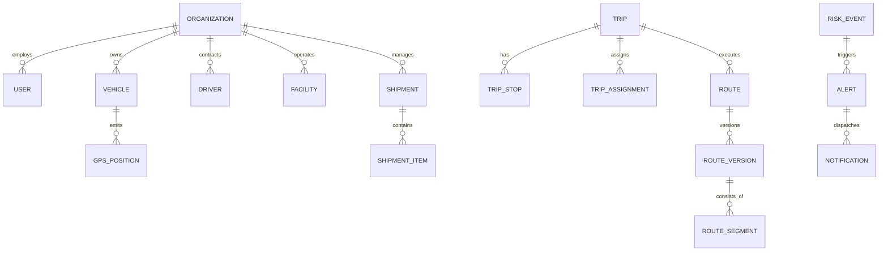

# AuraNER / NER-Route AI — Target Architecture Specification

## 1. Architectural Overview

**AuraNER / NER-Route AI** implements a distributed, event-driven, resilient enterprise architecture engineered for high-throughput logistics coordination, spatial computing, and AI-driven risk mitigation in India's North Eastern Region.

The architecture decouples user-facing presentation (Next.js Web + React Native Mobile) from heavy geospatial computation, constraint optimization, and agentic workflows handled by a high-performance **FastAPI** backend cluster.

```
┌────────────────────────────────────────────────────────────────────────────────┐
│                              CLIENT TIER                                       │
│  ┌──────────────────────────────────────────┐  ┌────────────────────────────┐  │
│  │       Next.js 14 Web Platform            │  │  React Native Expo Mobile  │  │
│  │ (Dispatch Command, Fleet, GIS, Reports)  │  │ (Driver Navigation & Tele) │  │
│  └────────────────────┬─────────────────────┘  └─────────────┬──────────────┘  │
└───────────────────────┼──────────────────────────────────────┼─────────────────┘
                        │ HTTPS / WSS                          │ HTTPS / WSS
┌───────────────────────▼──────────────────────────────────────▼─────────────────┐
│                           API GATEWAY / INGRESS                                │
│                   NGINX / Azure App Gateway / Traefik                          │
│          TLS 1.3 Termination · WAF · Rate Limiting · CORS · Auth Proxy         │
└──────────────────────────────────────┬─────────────────────────────────────────┘
                                       │
┌──────────────────────────────────────▼─────────────────────────────────────────┐
│                    FASTAPI BACKEND APPLICATION CLUSTER                         │
│  ┌──────────────────┐  ┌──────────────────┐  ┌──────────────────────────────┐  │
│  │ Core REST & WS   │  │ OR-Tools Engine  │  │ LangGraph Multi-Agent Engine │  │
│  │ Controllers      │  │ (VRP / VRPTW)    │  │ (Rerouting, Risk Triage)     │  │
│  └──────────────────┘  └──────────────────┘  └──────────────────────────────┘  │
│  ┌──────────────────────────────────────────────────────────────────────────┐  │
│  │                           Provider Abstraction Layer                     │  │
│  │  Routing · Weather · Auth · Notification · Storage · AI · Geocoding      │  │
│  └──────────────────────────────────────────────────────────────────────────┘  │
└───────────────────────┬───────────────────────────────┬────────────────────────┘
                        │                               │
┌───────────────────────▼────────────────┐   ┌──────────▼────────────────────────┐
│     STATE & STREAMING LAYER (REDIS 7)  │   │     ASYNCHRONOUS WORKERS          │
│  - Telemetry Stream Buffer (Streams)   │   │  - Celery / Arq Distributed Task  │
│  - Pub/Sub for Live Radar Events       │   │  - Weather Ingestion & Polygon    │
│  - Distributed Route Lock Manager      │   │  - Background Multi-Depot VRP     │
│  - Short-Lived Geocoding Cache         │   │  - Batch Notification Dispatch    │
└───────────────────────┬────────────────┘   └──────────┬────────────────────────┘
                        │                               │
┌───────────────────────▼───────────────────────────────▼────────────────────────┐
│                   PERSISTENCE TIER (POSTGRESQL 16 + POSTGIS 3.4)               │
│  ┌─────────────────────────┐ ┌─────────────────────────┐ ┌───────────────────┐ │
│  │ Core Relational Schema  │ │ PostGIS Spatial Engine  │ │ pgvector Engine   │ │
│  │ (Orgs, Users, Trips,    │ │ (LineStrings, Points,   │ │ (Incident Embeds, │ │
│  │  Shipments, Fleet)      │ │  ST_DWithin, Buffers)   │ │  Agent Memory)    │ │
│  └─────────────────────────┘ └─────────────────────────┘ └───────────────────┘ │
└────────────────────────────────────────────────────────────────────────────────┘
```

---

## 2. Core Architectural Components

### 2.1 Web Platform: Next.js 14 (App Router)
- **Role**: Operator command portal, administrative UI, and situational radar center.
- **Key Modules**: Dashboard, Fleet, Drivers, Shipments, Trips, Routes, Live Map, Risk & Alerts, AI Intelligence, Accessibility Intelligence, Analytics, Organization, Audit Logs, Settings.
- **Mapping**: Hardware-accelerated vector mapping via MapLibre GL with 3D terrain pitch and dynamic hazard layers.
- **Communication**: Interacts with FastAPI via typed REST endpoints and WebSocket/SSE channels for live telemetry feeds.

### 2.2 Mobile Platform: React Native (Expo SDK 51+)
- **Role**: Field navigation and real-time tracking application for drivers.
- **Key Modules**: Driver auth, Home, My Trip, Navigation, Trip Status, Report Problem, Notifications, SOS, Profile, Offline Synchronization.
- **Offline First**: Local SQLite / WatermelonDB storing offline map tiles, active corridor geometry, and an outbox queue for GPS pings and incident reports.

### 2.3 Backend Engine: FastAPI (Python 3.11+)
- **Role**: Central intelligence hub, business domain enforcement, GIS computation, and optimization server.
- **Framework Highlights**: Native asynchronous concurrency (`async`/`await`), Pydantic v2 data validation, SQLModel / SQLAlchemy 2.0 with GeoAlchemy2 spatial integration, and automated OpenAPI documentation.

### 2.4 Spatial Database: PostgreSQL 16 + PostGIS 3.4 + pgvector
- **Spatial Computing**: PostGIS provides native spatial functions (`ST_DWithin`, `ST_Buffer`, `ST_Intersects`, `ST_Contains`) for boundary checking, proximity alerting, and road segment indexing.
- **pgvector Justification**: High-dimensional vector embeddings ($1536$-dim or $768$-dim) used for:
  1. Semantic retrieval of unstructured incident bulletins (NDRF advisories, BRO road clearing notices, police reports).
  2. Long-term episodic memory for LangGraph agents to recall historic mountain detour strategies during seasonal landslides.

### 2.5 In-Memory Cache & Message Broker: Redis 7
- **Telemetry Ingestion**: Ingests high-frequency GPS breadcrumbs using Redis Streams to decouple ingestion from PostgreSQL write IO.
- **Pub/Sub Broker**: Real-time event broadcasting of driver location updates and critical hazard alerts to active Dispatcher browser sessions.
- **Distributed Locks**: Redis Redlock for preventing concurrent conflicting route recalculations on the same shipment.

### 2.6 Constrained Optimization: Google OR-Tools
- **Role**: Solves complex logistics problems including:
  - Vehicle Routing Problem with Time Windows (VRPTW).
  - Capacitated Vehicle Routing Problem (CVRP) with elevation gradient and road width restrictions.
  - Multi-depot disaster relief supply allocation across isolated mountain districts.

### 2.7 Multi-Agent Orchestration: LangGraph
- **Role**: Stateful, cyclical AI agent workflows for:
  - **Risk Triage Agent**: Evaluates incoming incident reports, verifies confidence scores, and cross-references meteorological satellite radar.
  - **Dynamic Reroute Agent**: Analyzes vehicle physical capabilities, calculates candidate detours using OR-Tools, and produces explainable reroute recommendations for dispatcher approval.

---

## 3. Provider Abstractions & Interfaces

To eliminate vendor lock-in and guarantee 100% operational resilience during external provider downtime, the system mandates abstract interfaces with built-in circuit breakers and local failovers.

```
┌────────────────────────────────────────────────────────────────────────────────┐
│                           PROVIDER ABSTRACTION INTERFACES                      │
├─────────────────────────┬────────────────────────────┬─────────────────────────┤
│ Interface               │ Primary Production Provider│ Resilient Fallback      │
├─────────────────────────┼────────────────────────────┼─────────────────────────┤
│ RoutingService          │ NextBillion.ai / OSRM      │ Self-hosted OSRM / GIS  │
│ WeatherService          │ Tomorrow.io / Open-Meteo   │ IMD Grid / Local Models │
│ AuthenticationService   │ Firebase Authentication    │ Supabase Auth / JWT     │
│ NotificationService     │ Firebase Cloud Messaging   │ Twilio SMS / Resend     │
│ StorageService          │ Azure Blob / AWS S3        │ MinIO (Self-hosted)     │
│ AIService               │ LangGraph + Claude / GPT-4 │ Local Mistral / Llama 3 │
│ GeocodingService        │ Mapbox / Nominatim         │ NER Spatial GIS Index   │
└─────────────────────────┴────────────────────────────┴─────────────────────────┘
```

### 3.1 RoutingService Interface
```typescript
export interface RoutingService {
  calculateRoute(
    origin: Coordinates,
    destination: Coordinates,
    constraints?: {
      avoidPolygons?: GeoJSONPolygon[];
      maxGradientPct?: number;
      maxVehicleWidthMeters?: number;
      requires4x4?: boolean;
    }
  ): Promise<RouteCalculationResult>;

  calculateMatrix(
    origins: Coordinates[],
    destinations: Coordinates[]
  ): Promise<DistanceMatrixResult>;
}
```

### 3.2 WeatherService Interface
```typescript
export interface WeatherService {
  getObservation(coords: Coordinates): Promise<WeatherObservation>;
  getCorridorForecast(routePoints: Coordinates[]): Promise<WeatherCorridorForecast>;
  getActiveSevereAlerts(bbox: BoundingBox): Promise<WeatherAlert[]>;
}
```

### 3.3 AuthenticationService Interface
```typescript
export interface AuthenticationService {
  verifyIdToken(token: string): Promise<AuthUserRecord>;
  revokeSession(userId: string): Promise<void>;
  createCustomToken(uid: string, claims: Record<string, unknown>): Promise<string>;
}
```

### 3.4 NotificationService Interface
```typescript
export interface NotificationService {
  sendPush(token: string, notification: PushMessage): Promise<NotificationResult>;
  sendSMS(phone: string, message: string): Promise<NotificationResult>;
  sendEmergencyBroadcast(topic: string, alert: EmergencyPayload): Promise<void>;
}
```

### 3.5 StorageService Interface
```typescript
export interface StorageService {
  uploadFile(key: string, data: Buffer, contentType: string): Promise<string>;
  getPresignedUrl(key: string, expiresInSeconds: number): Promise<string>;
  deleteFile(key: string): Promise<void>;
}
```

### 3.6 AIService Interface
```typescript
export interface AIService {
  runAgentWorkflow(workflowId: string, context: AgentContext): Promise<AgentExecutionResult>;
  generateEmbeddings(text: string): Promise<number[]>;
  chatCompletion(messages: ChatMessage[], tools?: ToolDefinition[]): Promise<ChatResponse>;
}
```

### 3.7 GeocodingService Interface
```typescript
export interface GeocodingService {
  geocode(query: string, options?: GeocodeOptions): Promise<GeocodedLocation[]>;
  reverseGeocode(coords: Coordinates): Promise<GeocodedLocation | null>;
}
```

---

## 4. Planned Domain Model (30+ Core Entities)

The domain data model establishes strict relational integrity, spatial indexing, multi-tenancy scoping, and audit traceability across all logistics functions.



### 4.1 Organizations & Identity
1. **`organizations`**: Master tenant record (id, name, code, type, contact_info, created_at, updated_at).
2. **`users`**: User identity linked to Firebase UID (id, org_id, email, phone, full_name, is_active, created_at).
3. **`roles`**: System & custom RBAC roles (`SUPER_ADMIN`, `ORG_ADMIN`, `DISPATCHER`, `LOGISTICS_MANAGER`, `DRIVER`, `VIEWER`).
4. **`permissions`**: Granular security capabilities (e.g. `shipments:dispatch`, `routes:override`).
5. **`organization_members`**: User-to-organization mapping with assigned roles and tenant boundaries.

### 4.2 Fleet & Assets
6. **`vehicles`**: Fleet assets (id, org_id, reg_no, type, capacity_kg, volume_m3, max_gradient_pct, max_width_meters, has_cold_chain, status, current_gps).
7. **`vehicle_documents`**: Registration certificates, road permits, mountain fitness certs, insurance policies.
8. **`vehicle_maintenance`**: Service logs, scheduled inspections, brake-wear tracking, repair records.
9. **`drivers`**: Personnel records (id, user_id, org_id, license_no, license_expiry, mountain_experience_years, duty_status).
10. **`driver_documents`**: Commercial driver licenses, medical fitness clearances, verification badges.

### 4.3 Network & Facilities
11. **`locations`**: Geospatial hubs (id, name, state, district, geom: Point, elevation_m, accessibility_tier, road_quality).
12. **`facilities`**: Physical depots, warehouses, hospitals, relief camps, fuel depots, police stations.

### 4.4 Cargo & Shipments
13. **`shipments`**: Master cargo consignment (id, org_id, tracking_code, origin_id, dest_id, priority, status, cold_chain_required, created_at).
14. **`shipment_items`**: Manifest lines (id, shipment_id, sku, description, weight_kg, volume_m3, is_hazardous).

### 4.5 Trips & Operational Dispatch
15. **`trips`**: Dispatch lifecycle execution (id, org_id, trip_code, vehicle_id, driver_id, status, scheduled_start, actual_start, completed_at).
16. **`trip_stops`**: Ordered transit waypoints (id, trip_id, stop_order, facility_id, planned_arrival, actual_arrival, stop_type).
17. **`trip_assignments`**: Audit association between trip, driver, and vehicle.

### 4.6 Routes & Topology
18. **`routes`**: Master route record connecting an origin and destination corridor.
19. **`route_versions`**: Immutable historical versions of planned or recalculated routes (id, route_id, geom: LineString, distance_km, duration_min, elevation_gain_m).
20. **`route_segments`**: Atomic road sectors with terrain grade, condition score, and bridge weight restrictions.

### 4.7 Telemetry & IoT
21. **`gps_positions`**: High-throughput GPS breadcrumb records (id, vehicle_id, trip_id, geom: Point, speed_kmh, heading, altitude_m, accuracy_m, timestamp).

### 4.8 Hazards, Risk & Alerts
22. **`risk_events`**: Active situational threats (id, type, severity, geom: Polygon/Point, confidence, detected_at, status).
23. **`weather_events`**: Severe meteorological conditions (monsoon rain intensity, cloudburst, flash flood, cyclone).
24. **`road_events`**: Physical highway obstructions (landslides, rockfalls, bridge collapses, military checkpoints).
25. **`accessibility_events`**: District or valley isolation declarations and seasonal road closures.
26. **`alerts`**: Multi-tier operational warnings (id, trip_id, risk_event_id, severity, distance_km, status, acknowledged_at).
27. **`notifications`**: Outbound transmission records across Push, SMS, and Email channels.

### 4.9 Optimization & AI Orchestration
28. **`logistics_requests`**: Unoptimized demand orders queued for batch assignment.
29. **`optimization_runs`**: OR-Tools solver executions (id, input_payload, algorithm, status, solution_metrics, computed_at).
30. **`agent_runs`**: LangGraph workflow executions (id, agent_name, trigger_event, initial_state, final_state, execution_time_ms).
31. **`agent_tool_calls`**: Audit trace of individual tools invoked by AI agents (e.g. `calculate_detour`, `query_weather`).

### 4.10 Data Ingestion & Auditing
32. **`data_sources`**: External API feeds (IMD Weather, BRO Bulletins, OpenStreetMap, NDRF reports).
33. **`data_ingestion_runs`**: Periodic ingestion logs, schema validation errors, and record count statistics.
34. **`audit_logs`**: Cryptographically chained, immutable system logs for legal compliance and forensic security.

---

## 5. Multi-Tenancy & Security Boundaries

### 5.1 Multi-Tenancy Model
- **Logical Partitioning with Row-Level Security (RLS)**:
  - All tenant-owned tables include a mandatory `org_id UUID NOT NULL REFERENCES organizations(id)` foreign key.
  - PostgreSQL Row-Level Security (RLS) policies enforce that queries automatically filter by the tenant ID associated with the calling user's JWT.
- **Cross-Tenant Exceptions**:
  - `SUPER_ADMIN` users can bypass tenant filters for cross-regional emergency disaster coordination.
  - Public hazard events (`risk_events`, `road_events`) and geographic hubs (`locations`) are shared globally across all tenants for collective road safety intelligence.

### 5.2 Security Principles
1. **Zero Trust Network Access (ZTNA)**: Every internal RPC, API request, and telemetry submission must present valid, unexpired credentials.
2. **Cryptographic Tamper-Evidence**: Audit log entries include a SHA-256 hash chaining mechanism (`hash = SHA256(prev_hash + entry_data)`), ensuring log tampering is mathematically detectable.
3. **Least Privilege RBAC**: Permissions are assigned strictly based on verified operational roles.

---

## 6. Environment Strategy (DEV, STAGING, PRODUCTION)

```
┌─────────────────┬──────────────────────┬────────────────────────┬──────────────────────┐
│ Attribute       │ Development (DEV)    │ Staging (STAGING)      │ Production (PROD)    │
├─────────────────┼──────────────────────┼────────────────────────┼──────────────────────┤
│ Hosting Web     │ Vercel Preview / Loc │ Azure App Service      │ Azure / AWS Multi-AZ │
│ Hosting Backend │ Local Docker / dev.py│ Azure Container Apps   │ Kubernetes (AKS/EKS) │
│ Database        │ PostgreSQL + PostGIS │ Managed Azure PG (Dev) │ Managed Azure PG HA  │
│ Redis           │ Local Redis Docker   │ Azure Cache for Redis  │ Redis Enterprise HA  │
│ Routing Data    │ OSRM Test Slice      │ Full NER OSRM Cluster  │ NextBillion + OSRM   │
│ External APIs   │ Sandboxes / Mocks    │ Real API Test Keys     │ Enterprise Licenced  │
│ Telemetry       │ Test Scenarios       │ Driver Dogfood Fleet   │ Live Active Vehicles │
│ Logging Level   │ DEBUG                │ INFO                   │ WARN / ERROR         │
└─────────────────┴──────────────────────┴────────────────────────┴──────────────────────┘
```
