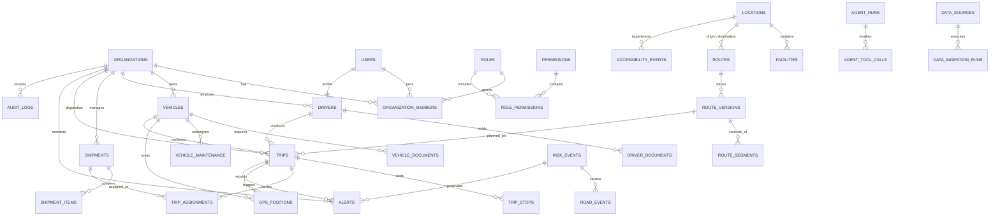

# Database Architecture & Domain Schema Specification
## PostgreSQL 16 + PostGIS 3.4 + pgvector Enterprise Schema

### 1. Executive Summary

This specification establishes the production database foundation for the **AuraNER / NER-Route AI** platform. Built upon **PostgreSQL 16** with **PostGIS 3.4** and **pgvector**, the database serves as the single source of truth for critical logistics operations across Northeast India's 8 states.

The schema is engineered for:
1. **Multi-Tenancy**: Organization-scoped isolation via foreign keys and Row-Level Security (RLS).
2. **Geospatial Precision**: Geodetic calculations on the WGS 84 ellipsoid (`GEOGRAPHY(Point, 4326)`) and planar geometries (`GEOMETRY(LineString/Polygon, 4326)`) with PostGIS GiST spatial indexing.
3. **Semantic AI Capabilities**: High-dimensional vector embeddings (`vector(1536)`) for natural language incident matching and agent long-term memory.
4. **Tamper-Evident Auditability**: Cryptographically chained SHA-256 state tracking in `audit_logs` for regulatory and disaster-response accountability.
5. **Zero Synthetic Operational Records**: Purely structural DDL and deterministic system configuration; test scenarios and development fixtures are strictly separated.

---

### 2. Core Extensions & Schema Infrastructure

```sql
CREATE EXTENSION IF NOT EXISTS "uuid-ossp"; -- UUIDv4 primary keys
CREATE EXTENSION IF NOT EXISTS "postgis";   -- Spatial points, linestrings, polygons & geodetic ops
CREATE EXTENSION IF NOT EXISTS "vector";    -- 1536-dim vector embeddings for AI models
```

#### Automated Timestamp Function
All tables with mutable records feature an automated trigger executing `update_timestamp_column()`, ensuring `updated_at` reliably tracks every mutation without client clock drift.

---

### 3. Entity Domain Architecture (34 Entities)

The 34 entities are partitioned across 12 functional clusters:



---

### 4. Entity Catalog & Table Dictionary

#### 4.1 Organizations & Multi-Tenancy
- **`organizations`**: Root tenant container. Stores legal entity code, agency classification (`government`, `logistics`, `emergency`, `defense`, `ngo`), state headquarters, and tenant configuration.
- **`roles`**: System and tenant RBAC roles (`SUPER_ADMIN`, `ORG_ADMIN`, `DISPATCHER`, `LOGISTICS_MANAGER`, `DRIVER`, `VIEWER`).
- **`permissions`**: Granular capability codes structured by functional module (e.g. `shipments:create`, `routes:override`, `fleet:manage`).
- **`role_permissions`**: Many-to-many relationship mapping roles to specific permissions.
- **`users`**: Platform user accounts. Stores profile info, contact numbers, and optional federated authentication references (`firebase_uid`).
- **`organization_members`**: Organization-to-user membership link with assigned tenant role and active status.

#### 4.2 Geospatial Infrastructure & Facilities
- **`locations`**: Geospatial settlements across Northeast India (cities, towns, remote mountain villages, border checkposts). Features geodetic coordinates (`GEOGRAPHY(Point, 4326)`), elevation in meters, population, accessibility tiers (`HIGH`, `MEDIUM`, `LOW`, `ISOLATED`), and road access quality (`ALL_WEATHER`, `FAIR_WEATHER`, `4X4_ONLY`, `RESTRICTED`).
- **`facilities`**: Physical operational nodes (warehouses, PDS supply depots, hospitals, relief distribution centers, fuel stations). Scoped to organizations with storage capacity in tons, cold storage capability, and precise GPS points.

#### 4.3 Fleet, Documents & Maintenance
- **`vehicles`**: Physical fleet assets. Includes payload capacity (kg), volumetric capacity ($m^3$), hill gradient tolerance (%), water-fording depth (mm), cold chain apparatus, fuel type/capacity, live fuel level %, operational status, and cached current location (`GEOGRAPHY(Point, 4326)`).
- **`vehicle_documents`**: Regulatory paperwork (RC, fitness certificates, mountain hill permits, commercial insurance) with issue and expiry tracking.
- **`vehicle_maintenance`**: Service logs including mountain suspension overhauls, brake servicing, odometer tracking, and next scheduled service interval.
- **`drivers`**: Qualified operators linked to user accounts. Tracks hill driving licenses, mountain terrain experience (years), safety score (0–100), duty status (`AVAILABLE`, `ON_TRIP`, `RESTING`, `OFF_DUTY`), and active vehicle assignment.
- **`driver_documents`**: Specialized credentials including heavy mountain hill endorsements, medical fitness certificates, and police clearances.

#### 4.4 Consignments & Inventory
- **`shipments`**: Freight consignments. Categorized by cargo classification (`GENERAL_FREIGHT`, `MEDICAL_VACCINES`, `ESSENTIAL_PDS`, `HAZMAT`, `DISASTER_RELIEF`), priority (`LOW` to `CRITICAL`), dispatch and delivery timestamps, cold-chain temperature thresholds, and Proof of Delivery (signature & photo URLs).
- **`shipment_items`**: Line items within a shipment, recording SKU, weight, volume, fragility flags, and hazardous goods indicators.

#### 4.5 Routing & Topography
- **`routes`**: Logical transit corridors between origin and destination locations, referencing official highway codes (e.g. NH-29, NH-2, NH-10).
- **`route_versions`**: Immutable geometry snapshots (`GEOMETRY(LineString, 4326)`) tracking total distance (km), estimated duration (minutes), cumulative elevation gain (meters), maximum gradient (%), and composite risk score (0–100).
- **`route_segments`**: Sequential segments of a route version with individual geometry, road condition score, terrain type (`PLAIN`, `HILLY`, `MOUNTAINOUS`), bridge weight ratings, and vehicle width clearance limits.

#### 4.6 Operations & Dispatch
- **`trips`**: Active or scheduled journey executing a specific route version with an assigned vehicle and driver.
- **`trip_stops`**: Ordered sequence of stops (pickup, delivery, checkpoint, rest stop, safe haven) with planned and actual arrival/departure timestamps.
- **`trip_assignments`**: Association between trips and the consignments loaded onto the vehicle.

#### 4.7 High-Frequency Telematics
- **`gps_positions`**: Time-series telemetry tracking vehicle positions on the geoid (`GEOGRAPHY(Point, 4326)`), instantaneous speed (km/h), bearing/heading (degrees), barometric altitude (meters), accuracy, and device battery percentage.

#### 4.8 Situational Hazards & Environmental Intelligence
- **`risk_events`**: Environmental and infrastructure hazards (landslides, flash floods, rockfalls, road subsidence, seismic events, security closures). Stores affected hazard polygon (`GEOMETRY(Polygon, 4326)`), epicenter point, confidence score, resolution status, and a 1536-dimensional vector embedding for NLP situational matching.
- **`weather_events`**: Real-time meteorological readings (temperature, hourly rainfall mm, 24h accumulated rainfall mm, wind speed, visibility km, storm condition codes).
- **`road_events`**: Specific highway disruptions linked to risk events, indicating blockage nature (`BOTH_LANES_BLOCKED`, `SINGLE_LANE_OPEN`, `TEMPORARY_DIVERSION`, `BRIDGE_UNSAFE`) and clearance ETA.
- **`accessibility_events`**: Administrative declarations altering the accessibility status of remote villages (e.g. transitioning from `MEDIUM` to `ISOLATED` due to bridge collapse).

#### 4.9 Alerts & Dispatch Communications
- **`alerts`**: Urgent operational notifications generated by hazard proximity calculations, vehicle telemetry anomalies, or dispatch exceptions.
- **`notifications`**: Multi-channel delivery logs (Push FCM, SMS Twilio, Email Resend, In-App) tracking recipient delivery timestamps.

#### 4.10 AI Demand, Optimization & Autonomous Agents
- **`logistics_requests`**: Demand requests submitted by relief agencies or commercial shippers awaiting combinatorial fleet routing.
- **`optimization_runs`**: Execution log of mathematical solvers (Google OR-Tools VRPTW / CVRP / Terrain Heuristics) recording computation time, inputs, and allocation metrics.
- **`agent_runs`**: Autonomous LLM agent execution logs (Risk Triage Agent, Detour Replanning Agent, Demand Allocator) capturing reasoning chains and memory vector embeddings.
- **`agent_tool_calls`**: Structured log of individual tool invocations executed by AI agents during an operational run.

#### 4.11 Data Feeds & Ingestion
- **`data_sources`**: External radar and feed registry (IMD Radar, BRO Road Bulletins, OpenStreetMap NER, NDRF disaster feeds).
- **`data_ingestion_runs`**: Execution logs of scheduled polling workers tracking ingested records, rejection errors, and execution latency.

#### 4.12 Tamper-Evident Auditing
- **`audit_logs`**: Append-only log recording every sensitive action (shipment dispatch, route override, alert acknowledgment, SOS trigger). Incorporates cryptographic hash chaining:
  $$\text{current\_hash} = \text{SHA-256}(\text{previous\_hash} + \text{action} + \text{entity\_id} + \text{timestamp} + \text{payload})$$

---

### 5. Spatial Indexing Strategy (PostGIS GiST)

Spatial proximity queries (such as vehicle-to-hazard buffer interception, safe-haven radial search, and route-polygon collision detection) rely on PostGIS Generalized Search Tree (GiST) indexes:

| Table | Column | Type | Index Name | Use Case |
|---|---|---|---|---|
| `locations` | `coordinates` | `GEOGRAPHY(Point)` | `idx_locations_coordinates` | Settlement radial search & nearest node lookup |
| `facilities` | `coordinates` | `GEOGRAPHY(Point)` | `idx_facilities_coordinates` | Warehouse / depot proximity routing |
| `vehicles` | `current_location` | `GEOGRAPHY(Point)` | `idx_vehicles_current_location` | Live fleet radar & map clustering |
| `route_versions` | `geometry` | `GEOMETRY(LineString)` | `idx_route_versions_geometry` | Route corridor hazard intersection |
| `route_segments` | `geometry` | `GEOMETRY(LineString)` | `idx_route_segments_geometry` | Localized bottleneck & grade analysis |
| `gps_positions` | `coordinates` | `GEOGRAPHY(Point)` | `idx_gps_positions_coordinates` | Breadcrumb tracking & deviation detection |
| `risk_events` | `affected_geometry` | `GEOMETRY(Polygon)` | `idx_risk_events_affected_geom` | ST_Intersects / ST_DWithin hazard containment |
| `risk_events` | `epicenter` | `GEOGRAPHY(Point)` | `idx_risk_events_epicenter` | Radial proximity distance calculations |
| `weather_events` | `coordinates` | `GEOGRAPHY(Point)` | `idx_weather_events_coordinates` | Weather station Voronoi / interpolation |
| `road_events` | `coordinates` | `GEOGRAPHY(Point)` | `idx_road_events_coordinates` | Highway blockage waypoint matching |

---

### 6. AI Vector Search Architecture (pgvector)

The database incorporates the `vector` extension with 1536-dimensional vectors:
1. **Situational Incident Matching (`risk_events.embedding`)**: Unstructured police reports, local news bulletins, and radio transcripts are vectorized. Incoming alert queries are matched against active events using cosine distance ($1 - \text{cosine\_similarity}$) or negative inner product.
2. **Autonomous Agent Memory (`agent_runs.memory_vector`)**: Agent reasoning traces and post-incident reviews are stored as episodic memory vectors, enabling agents to retrieve historical precedent when resolving novel monsoon corridor disruptions.

---

### 7. Multi-Tenancy & Row-Level Security (RLS)

All tenant-scoped tables enforce PostgreSQL Row-Level Security:
```sql
ALTER TABLE organizations ENABLE ROW LEVEL SECURITY;
ALTER TABLE vehicles ENABLE ROW LEVEL SECURITY;
ALTER TABLE drivers ENABLE ROW LEVEL SECURITY;
ALTER TABLE shipments ENABLE ROW LEVEL SECURITY;
ALTER TABLE trips ENABLE ROW LEVEL SECURITY;
ALTER TABLE alerts ENABLE ROW LEVEL SECURITY;
ALTER TABLE audit_logs ENABLE ROW LEVEL SECURITY;
```

#### Application Service Role
In Phase 3 and Phase 4, the backend interacts via the Supabase Service Role key when executing system-level background jobs (telemetry ingestion, optimization, alerting). RLS policies allow authenticated service execution while laying down strict isolation boundaries for tenant portal users in subsequent phases.

---

### 8. Migration Management & Standards

- Migrations reside strictly in `supabase/migrations/`.
- `0001_init.sql`: Core baseline schema.
- `0002_domain_expansion.sql`: Comprehensive 34-entity PostGIS + pgvector enterprise domain schema.
- Migrations are idempotent (`CREATE TABLE IF NOT EXISTS`, `CREATE INDEX IF NOT EXISTS`, `DO $$ ... $$`).
- Zero synthetic mock data is committed into production migrations; local developer test fixtures are kept segregated in testing suites.
