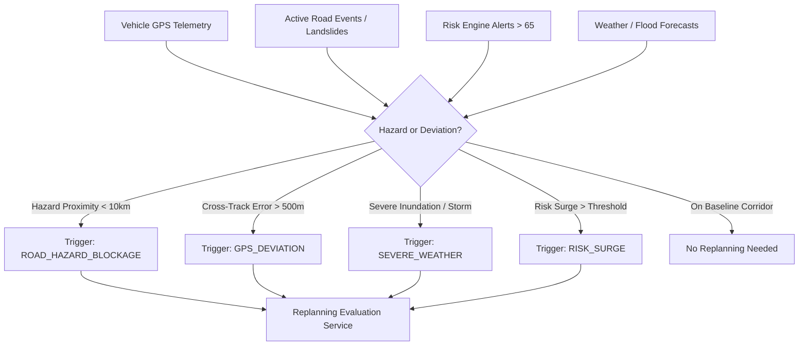
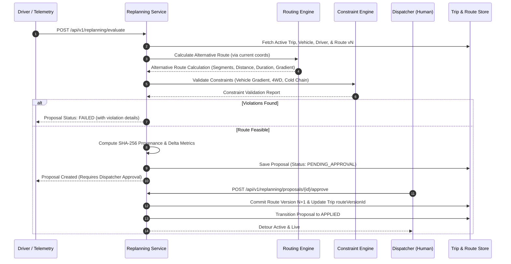

# Phase 19: Dynamic Replanning Architecture & Specifications

## 1. Executive Summary & Core Principles

The **Dynamic Replanning Architecture** in AuraNER / NER-Route AI provides real-time, resilient route recalculation and in-transit operational replanning across Northeast India's complex multi-modal geography. It is engineered around strict non-negotiable enterprise and civil defense principles:

```
AI reasons.
APIs provide facts.
Algorithms calculate.
Backend enforces.
Humans approve critical decisions.
```

### Critical Invariants
1. **Zero-Fabrication Invariant**:
   - The engine never fabricates fictitious detours, mock terrain features, or synthetic conditions.
   - All triggers are bound to verified spatial facts (e.g. GPS off-route deviation $>500$m, active road hazards $<10$km ahead, real-time risk scores $>65/100$, severe weather warnings).
   - If no feasible alternative route exists that satisfies vehicle chassis gradients or driver safety envelopes, the system does not invent an impossible pass; it marks the proposal as `FAILED` with explicit violation diagnostics.
2. **Non-Silent Mutation Invariant**:
   - Existing active trips and baseline route versions are **never silently overwritten**.
   - Original route baselines are immutably archived as Version $N$.
   - Any proposed detour generates an isolated `ReplanningProposal` requiring dispatcher clearance (`PENDING_APPROVAL`).
   - Only when an authorized dispatcher (`shipments:dispatch` clearance) approves the proposal is a new Route Version $N+1$ atomically committed and bound to the trip.

---

## 2. Trigger Detection Engine

The detection subsystem continuously correlates real-time telemetry and hazard streams against the trip's baseline corridor geometry:



### Trigger Types & Thresholds
- `GPS_DEVIATION`: Vehicle location cross-track distance exceeds $500$ meters from the current corridor polyline.
- `ROAD_HAZARD_BLOCKAGE`: Active landslide, rockfall, or road blockage detected within $10$ km ahead of current coordinates along the corridor.
- `SEVERE_WEATHER`: Severe precipitation ($>50$ mm/hr) or flash flood warning intersecting forward route segments.
- `RISK_SURGE`: Segment composite risk index exceeding critical safety threshold ($>65/100$).
- `OPERATIONAL_CHANGE`: Dynamic schedule modification, delivery priority escalation, or stop sequence rearrangement.

---

## 3. Proposal Synthesis & Constraint Validation Pipeline

Once triggered, the replanning engine executes a deterministic 5-stage synthesis pipeline:



### Physical & Operational Constraints Evaluated
1. **Vehicle Gradient Capability**:
   - Asserts $\text{maxGradientPct}_{\text{route}} \le \text{maxGradientPct}_{\text{vehicle}}$.
   - E.g., Tata Xenon 4WD ($35\%$) vs Light Van ($5\%$).
2. **4WD Mountain Pass Mandate**:
   - Mountainous sectors with gradient $>14\%$ mandate 4WD chassis clearance; low-clearance vans are disqualified.
3. **Cold Chain Stability Window**:
   - For non-refrigerated vehicles transporting perishable/medical cargo, ETA delays $>60$ minutes trigger cold-chain boundary violations.
4. **Driver Duty Hours & Mountain Experience**:
   - Rest period compliance and mountain terrain qualification.

---

## 4. Human-in-the-Loop Approval Workflow

In alignment with military and disaster relief operational standards, critical route diversions require dispatcher sign-off:

| Proposal Status | Approval Status | Meaning | Action Allowed |
|---|---|---|---|
| `PENDING_APPROVAL` | `PENDING` | Alternative calculated; requires dispatcher review | Dispatcher may approve or reject |
| `APPROVED` | `APPROVED` | Dispatcher authorized; ready for route commitment | Engine commits Route Version $N+1$ |
| `APPLIED` | `APPROVED` | Route Version $N+1$ committed and trip repointed | Trip is en route via new corridor |
| `REJECTED` | `REJECTED` | Dispatcher rejected alternative proposal | Trip remains on existing route baseline |
| `FAILED` | `REJECTED` | Infeasible due to vehicle/terrain physical limits | Dispatcher notified of physical impossibility |

---

## 5. Route Versioning & Audit Provenance

Every replanning event creates an immutable cryptographic paper trail:
- **`candidateRouteVersionId`**: Points to a new version (e.g. `v2`, `v3`) within the same canonical `Route` entity.
- **`provenanceHash`**: Computed as `SHA-256(proposalId + tripId + triggerType + alternativeGeometry + timestamp)`.
- **`audit_logs`**: Logs `TRIP_REPLANNING_PROPOSED`, `TRIP_REPLANNING_APPROVED`, `TRIP_REPLANNING_REJECTED`, and `TRIP_REPLANNING_APPLIED` with user ID and tenant isolation.

---

## 6. REST API Endpoints

### 1. Evaluate Replanning
`POST /api/v1/replanning/evaluate`
- **Required Role**: Dispatcher or Admin (`routes:calculate` permission).
- **Request Body**:
  ```json
  {
    "trip_id": "trp-1789877859-9912",
    "trigger_type": "ROAD_HAZARD_BLOCKAGE",
    "current_location": { "lat": 25.80, "lng": 93.85 },
    "reason": "Zubza pass landslide obstruction detected 3.2km ahead"
  }
  ```
- **Response**: `201 Created` with full `ReplanningProposal`.

### 2. List Replanning Proposals
`GET /api/v1/replanning/proposals?trip_id=...&status=...&limit=20`
- **Required Role**: Authenticated user (tenant-scoped).
- **Response**: `200 OK` with paginated proposal records.

### 3. Get Proposal Detail
`GET /api/v1/replanning/proposals/{id}`
- **Response**: `200 OK` with proposal details, deltas, and constraint diagnostics.

### 4. Approve Proposal
`POST /api/v1/replanning/proposals/{id}/approve`
- **Required Role**: Dispatcher or Admin (`shipments:dispatch` permission).
- **Request Body**:
  ```json
  {
    "comments": "Southern bypass approved by State Disaster Logistics cell",
    "apply_immediately": true
  }
  ```
- **Response**: `200 OK` with proposal status `APPLIED` and candidate route version committed.

### 5. Reject Proposal
`POST /api/v1/replanning/proposals/{id}/reject`
- **Required Role**: Dispatcher or Admin (`shipments:dispatch` permission).
- **Request Body**:
  ```json
  {
    "rejection_reason": "Bypass road also impassable due to flash floods"
  }
  ```
- **Response**: `200 OK` with proposal status `REJECTED`.

### 6. Apply Approved Proposal
`POST /api/v1/replanning/proposals/{id}/apply`
- **Required Role**: Dispatcher or Admin (`shipments:dispatch` permission).
- **Response**: `200 OK` with proposal status `APPLIED`.

---

## 7. Verification & Test Coverage

The dynamic replanning architecture is validated by 16 end-to-end integration and unit tests in [`src/lib/test/dynamic-replanning.test.ts`](file:///c:/Users/Asus/Documents/vscodefolder/ne-routeai-next/src/lib/test/dynamic-replanning.test.ts):
- ✅ GPS off-route deviation trigger detection ($>500$m).
- ✅ Forward road hazard proximity detection ($<10$km).
- ✅ Non-triggering when vehicle is strictly on corridor.
- ✅ Alternative detour synthesis with distance and ETA deltas.
- ✅ Non-silent mutation invariant (baseline trip untouched prior to approval).
- ✅ Dispatcher approval committing Route Version $N+1$ and repointing active trip.
- ✅ Idempotent re-approval without duplicate route versions.
- ✅ Rejection workflow preserving route and trip baseline integrity.
- ✅ Constraint validation failure diagnostics on excessive gradients ($>vehicle$).
- ✅ Multi-tenant isolation and cross-tenant access rejection.
- ✅ REST API endpoints RBAC authorization and 403 Forbidden enforcement.
