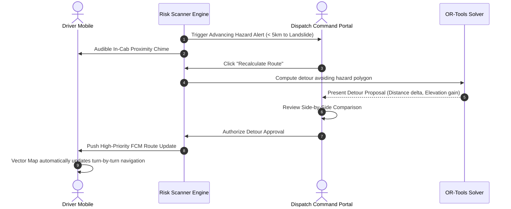

# AuraNER / NER-Route AI — Interaction Patterns & Operational Workflows

## 1. High-Impact Interaction Principles

Logistics operations in disaster-prone mountain corridors carry life-safety implications. Unintended button clicks, unverified route overrides, or misinterpreted telemetry can trigger catastrophic delays.

The interaction models establish **fail-safe friction**, **transparent data provenance**, and **structured triage protocols**.

---

## 2. Destructive-Action Patterns

High-consequence actions (e.g. Aborting a relief mission, decommissioning a vehicle, revoking organization access, or overriding a military road restriction) require the **Tier-3 Multi-Step Confirmation Pattern**.

```
┌─────────────────────────────────────────────────────────────────────────────┐
│                   TIER-3 DESTRUCTIVE ACTION CONFIRMATION                    │
├─────────────────────────────────────────────────────────────────────────────┤
│  ⚠ ABORT IN-TRANSIT DISPATCH                                               │
│                                                                             │
│  You are about to abort active shipment SHP-1048 currently in transit      │
│  along NH-29 carrying 650kg of temperature-sensitive medical vaccines.     │
│                                                                             │
│  Consequences:                                                              │
│  • Vehicle AS-01-AX-1010 will be immediately instructed to halt.           │
│  • Driver Officer Tenzing Norbu will receive an emergency stand-down alert. │
│  • Cold-chain refrigeration monitoring will transition to safe-haven hold.  │
│                                                                             │
│  To confirm, type the shipment code "SHP-1048" below:                       │
│  ┌───────────────────────────────────────────────────────────────────────┐  │
│  │ SHP-1048                                                              │  │
│  └───────────────────────────────────────────────────────────────────────┘  │
│                                                                             │
│  [Cancel Action]                                  [CONFIRM ABORT DISPATCH]  │
└─────────────────────────────────────────────────────────────────────────────┘
```

### 2.1 Confirmation Rules
1. **Explicit Typing Requirement**: The affirmative button remains disabled until the operator types the exact identifier (e.g., shipment code or vehicle registration).
2. **Explicit Consequence Bulletins**: The dialog must list the immediate real-world downstream impacts.
3. **Audited Logging**: The confirmation writes an immutable entry to `audit_logs` capturing the dispatcher's user ID, timestamp, and optional reason text.

---

## 3. Data Provenance & Trust Patterns

To prevent dangerous assumptions, all mission-critical data indicators include an explicit **Provenance Badge**:

```
┌─────────────────────────────────────────────────────────────────────────────┐
│                          DATA PROVENANCE BADGES                             │
├─────────────────┬──────────┬────────────────────────────────────────────────┤
│ Provenance Tier │ Color    │ Semantic Meaning                               │
├─────────────────┼──────────┼────────────────────────────────────────────────┤
│ `LIVE • GPS`    │ Teal     │ Verified hardware telematics ping (< 30s ago). │
│ `PROJECTED`     │ Info     │ Extended Kalman Filter (EKF) smoothed dead-reck│
│ `ESTIMATED`     │ Orchid   │ AI / OR-Tools heuristic model projection.       │
│ `CACHED`        │ Amber    │ Stored offline geographic or road baseline.     │
│ `UNVERIFIED`    │ Danger   │ Crowd-sourced hazard report pending clearance. │
└─────────────────┴──────────┴────────────────────────────────────────────────┘
```

### 3.1 Tooltip Traceability
Hovering or tapping on any provenance badge reveals:
- Source provider name (e.g., `IMD Satellite Radar`, `Vehicle IoT Gateway AS-01`).
- Exact timestamp of raw data capture.
- Confidence score percentage ($0\% - 100\%$).

---

## 4. Emergency Detour Recalculation & Acceptance Flow

When a vehicle in transit encounters an active hazard blockage ($< 5\text{km}$ ahead):



### 4.1 Side-by-Side Comparison Drawer
The Detour Approval Drawer displays:
- **Original Route (Blocked)**: Red line crossing hazard zone, $142\text{ km}$, ETA $+4.5\text{ hrs}$ delay.
- **Proposed Detour (Clear)**: Green line via diversion highway, $168\text{ km}$ ($+26\text{ km}$ delta), Max Gradient $9.2\%$, All-Weather asphalt.
- **Nearest Safe Havens**: Displays 3 nearest emergency points (e.g. Zubza Community Clinic, Highway Police Post) with contact phone numbers.

---

## 5. Multi-Tier Alert Triage Escalation Pattern

Incoming alerts are organized in a 4-tier urgency ladder:

```
┌─────────────────────────────────────────────────────────────────────────────┐
│                         ALERT TRIAGE ESCALATION                             │
├───────────────┬─────────────────────┬───────────────────┬───────────────────┤
│ Severity      │ Notification Action │ Escalation Window │ Responsible Role  │
├───────────────┼─────────────────────┼───────────────────┼───────────────────┤
│ `CRITICAL`    │ Siren + Red Screen  │ Immediate (< 2m)  │ Dispatcher / SDMA │
│ `HIGH`        │ Audio Chime + Push  │ 5 Minutes         │ Dispatcher        │
│ `MODERATE`    │ Badge Increment     │ 15 Minutes        │ Logistics Manager │
│ `LOW`         │ Silent Feed Entry   │ End of Shift      │ Operator / Viewer │
└─────────────────┴─────────────────────┴───────────────────┴───────────────────┘
```

### 5.1 Triage Action Trio
Every alert card contains three distinct action triggers:
1. `[Acknowledge]`: Changes state from `SENT` to `ACKNOWLEDGED`, stopping repetitive siren chimes.
2. `[Escalate to Command]`: Forwards the incident directly to State Disaster Authority / Police Control with one click.
3. `[Resolve & Clear]`: Confirms the road is open or the convoy has reached a safe haven; archives alert to audit logs.

---

## 6. Mobile In-Cab Gesture & Hardware Patterns

1. **Slide-to-Activate SOS**: A horizontal swipe track preventing accidental pocket triggering while bouncing in a truck cab.
2. **Push-to-Talk (PTT) Quick Check-in**: Holding the on-screen microphone button streams a 10-second compressed voice update to the dispatch radio queue.
3. **High-Contrast Night Switch**: Quick double-tap anywhere on the speed indicator toggles high-glare daylight / night vision mode without taking eyes off the road.
