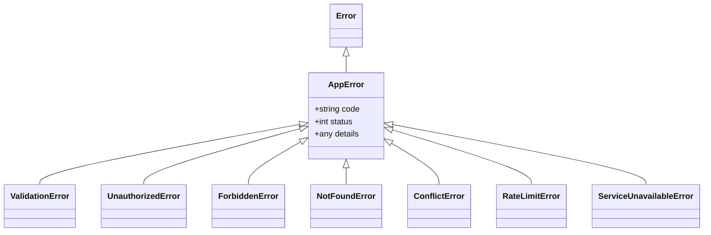

# AuraNER / NER-Route AI — Observability, Logging & Error Architecture

## 1. Observability Vision & Pillars

Mission-critical disaster and logistics software requires end-to-end visibility across all operations:

```
┌─────────────────────────────────────────────────────────────────────────────┐
│                        OBSERVABILITY ARCHITECTURE                           │
├─────────────────┬───────────────────────────────────────────────────────────┤
│ Pillar          │ Mechanism & Implementation                                │
├─────────────────┼───────────────────────────────────────────────────────────┤
│ 1. Logging      │ Structured JSON logging with PII masking & Log Levels.    │
│ 2. Tracing      │ OpenTelemetry distributed context propagation (W3C trace).│
│ 3. Metrics      │ Prometheus / Azure Monitor latency & throughput telemetry.│
│ 4. Probes       │ Two-tier Kubernetes health probes (Liveness vs Readiness).│
│ 5. Error Bounds │ Strongly typed `AppError` hierarchy & correlation IDs.    │
└─────────────────┴───────────────────────────────────────────────────────────┘
```

---

## 2. Structured JSON Logging Specification

Implemented in [`src/lib/logger.ts`](file:///c:/Users/Asus/Documents/vscodefolder/ne-routeai-next/src/lib/logger.ts):

### 2.1 Production Log Schema
Every log entry emitted in Staging and Production is a single-line, valid JSON string:

```json
{
  "timestamp": "2026-09-19T14:30:15.281Z",
  "level": "INFO",
  "message": "Shipment dispatched successfully",
  "environment": "production",
  "context": {
    "service": "ne-routeai-web",
    "requestId": "9b1deb4d-3b7d-4bad-9bdd-2b0d7b3dcb6d",
    "traceId": "4bf92f3577b34da6a3ce929d0e0e4736",
    "shipmentId": "SHP-1048",
    "vehicleId": "AS-01-AX-1010",
    "driverId": "DRV-9921",
    "durationMs": 42
  }
}
```

### 2.2 PII Masking & Sanitization
The logger automatically inspects metadata keys against sensitive regex patterns (`/password/`, `/token/`, `/secret/`, `/authorization/`, `/cookie/`, `/api_?key/`, `/phone/`, `/aadhaar/`). Matching fields are permanently replaced with `"[REDACTED]"` prior to write operations.

---

## 3. Two-Tier Health-Check Architecture

Implemented in [`src/app/api/health/route.ts`](file:///c:/Users/Asus/Documents/vscodefolder/ne-routeai-next/src/app/api/health/route.ts):

### 3.1 Liveness Probe (`GET /api/health` or `?probe=liveness`)
- **Purpose**: Fast process heartbeat used by Kubernetes / Azure App Gateway to determine if the container process is responsive.
- **Payload Response** (`HTTP 200`):
  ```json
  {
    "success": true,
    "data": {
      "status": "healthy",
      "probe": "liveness",
      "uptime_seconds": 384,
      "timestamp": "2026-09-19T14:30:00.000Z",
      "environment": "production",
      "version": "1.0.0"
    }
  }
  ```

### 3.2 Deep Readiness Probe (`GET /api/health?probe=readiness`)
- **Purpose**: Comprehensive dependency verification used to determine if the pod is ready to accept incoming traffic.
- **Verified Subsystems**:
  1. *Environment Configuration*: Validates all required variables pass Zod schema.
  2. *Database Status*: Verifies connection pool state and remote Supabase/PostgreSQL reachability.
  3. *Memory Allocation*: Confirms heap memory usage is below the 90% threshold.
  4. *Provider Configuration*: Confirms routing, geocoding, and weather providers are active.
- **Failure Handling**: If any critical subsystem is unready, returns `HTTP 503 Service Unavailable` with diagnostic checks detailing the failure.

---

## 4. Error-Handling Architecture (`AppError`)

Implemented in [`src/lib/api/response.ts`](file:///c:/Users/Asus/Documents/vscodefolder/ne-routeai-next/src/lib/api/response.ts):



### 4.1 Standardized API Error Response Envelope
```json
{
  "success": false,
  "error": {
    "code": "VALIDATION_ERROR",
    "message": "Validation failed",
    "details": [
      { "field": "cargo_weight_kg", "message": "Cargo weight must be positive" }
    ],
    "requestId": "9b1deb4d-3b7d-4bad-9bdd-2b0d7b3dcb6d"
  },
  "meta": {
    "timestamp": "2026-09-19T14:30:15.281Z",
    "requestId": "9b1deb4d-3b7d-4bad-9bdd-2b0d7b3dcb6d"
  }
}
```

---

## 5. Metrics & Operational Alert Rules

| Metric Key | Target Threshold | Alert Condition | Alert Severity |
| :--- | :--- | :--- | :--- |
| `http_requests_5xx_rate` | $< 0.1\%$ | $> 1.0\%$ for $> 3\text{ minutes}$ | `CRITICAL` (PagerDuty) |
| `route_calculation_p95_ms` | $< 1,500\text{ms}$ | $> 3,000\text{ms}$ for $> 5\text{ mins}$ | `HIGH` (Slack/Teams) |
| `telemetry_stream_lag_seconds`| $< 5\text{ seconds}$ | $> 30\text{ seconds}$ | `HIGH` (Logistics Ops) |
| `container_memory_usage_pct` | $< 75\%$ | $> 85\%$ sustained | `MODERATE` (Warning) |
