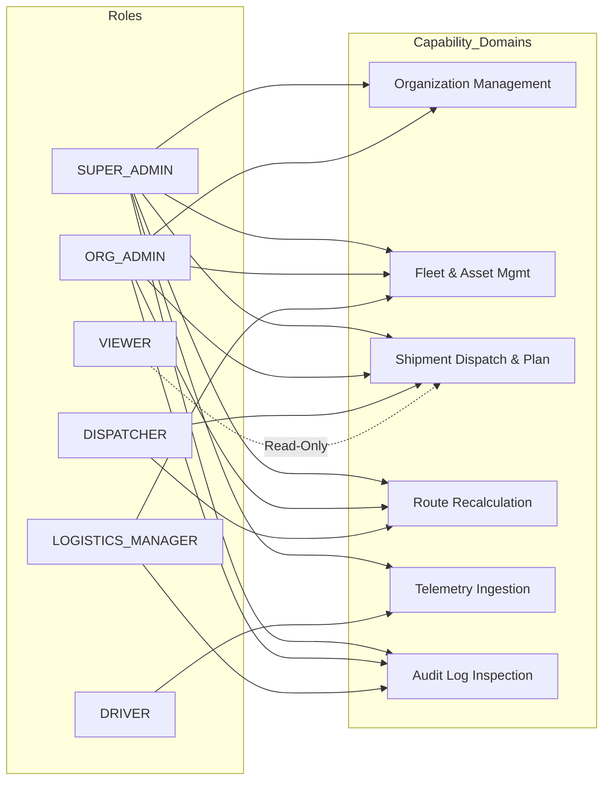

# Role-Based Access Control (RBAC) & Multi-Tenancy Architecture
## Enterprise Authorization & Tenant Isolation Specification

### 1. Executive Summary

This specification establishes the production **Role-Based Access Control (RBAC)** and **Multi-Tenancy Isolation Architecture** for the **AuraNER / NER-Route AI** platform. Built upon PostgreSQL 16 row-level security primitives and stateless JWT claims, this architecture guarantees strict data isolation across state disaster agencies, civil supplies departments, NDRF battalions, and commercial freight carriers operating in India's North Eastern Region.

Key architectural guarantees:
1. **Strict Server-Side Enforcement**: Client-side UI gating is purely cosmetic. Every API endpoint, mutation, and database query enforces role permissions and tenant scoping on the server.
2. **Deterministic Organization Isolation**: All operational entities (vehicles, drivers, shipments, trips, facilities, alerts, audit logs) are partitioned by `organization_id`. Non-`SUPER_ADMIN` users can NEVER access or mutate records belonging to another organization.
3. **Cross-Tenant Emergency Coordination**: Only `SUPER_ADMIN` accounts possess cross-tenant oversight to coordinate multi-agency disaster relief across state boundaries during monsoons, landslides, and road collapse emergencies.
4. **Public Road Safety Commons**: Terrain hazards (`risk_events`, `road_events`, `weather_events`, `accessibility_events`) and geographic settlements (`locations`) are globally shared across all tenants to maintain unified situational awareness.

---

### 2. The 6 Core Enterprise Roles

```
┌─────────────────────────────────────────────────────────────────────────────┐
│                    ENTERPRISE ROLE HIERARCHY & SCOPES                       │
├───────────────────┬───────────────────┬─────────────────────────────────────┤
│ Role              │ Scope             │ Primary Responsibilities            │
├───────────────────┼───────────────────┼─────────────────────────────────────┤
│ SUPER_ADMIN       │ Global Cross-     │ Platform administrator; provisions  │
│                   │ Tenant            │ organizations, configures systems,  │
│                   │                   │ cross-tenant emergency overrides.   │
├───────────────────┼───────────────────┼─────────────────────────────────────┤
│ ORG_ADMIN         │ Organization      │ Tenant administrator; provisions    │
│                   │                   │ members, facilities, and fleet.     │
├───────────────────┼───────────────────┼─────────────────────────────────────┤
│ DISPATCHER        │ Organization /    │ Operations controller; plans trips, │
│                   │ Corridor          │ dispatches freight, reroutes convoy.│
├───────────────────┼───────────────────┼─────────────────────────────────────┤
│ LOGISTICS_MANAGER │ Organization /    │ Fleet health, driver compliance,    │
│                   │ Fleet             │ transit analytics, audit review.    │
├───────────────────┼───────────────────┼─────────────────────────────────────┤
│ DRIVER            │ Personal / Trip   │ In-cab operator; telemetry pings,   │
│                   │                   │ delivery confirmation, hazard logs. │
├───────────────────┼───────────────────┼─────────────────────────────────────┤
│ VIEWER            │ Organization      │ Read-only observer; monitors radar, │
│                   │                   │ tracking, and public safety data.   │
└───────────────────┴───────────────────┴─────────────────────────────────────┘
```

---

### 3. Granular Capability & Permission Dictionary

| Module | Permission Code | Description |
|---|---|---|
| **Organizations** | `organizations:read` | Inspect organization profile and assigned hub facilities. |
| | `organizations:manage` | Provision, update, or deactivate tenant organizations (`SUPER_ADMIN`). |
| | `members:read` | View team members, assigned roles, and duty status. |
| | `members:manage` | Invite, assign roles, or remove team members (`ORG_ADMIN`, `SUPER_ADMIN`). |
| **Fleet** | `fleet:read` | View fleet inventory, specifications, and maintenance history. |
| | `fleet:manage` | Register, update, decommission vehicles, and schedule maintenance. |
| **Drivers** | `drivers:read` | View driver registry, certifications, mountain experience, and safety scores. |
| | `drivers:manage` | Enroll drivers, verify hill permits, and assign duty statuses. |
| **Shipments** | `shipments:create` | Create new cargo consignments and set priority/cold-chain constraints. |
| | `shipments:read` | View shipment manifests and status within the organization. |
| | `shipments:update` | Modify consignment details, cargo specifications, and destination. |
| | `shipments:dispatch`| Assign vehicle, driver, and execute formal consignment dispatch. |
| | `shipments:cancel` | Abort a planned or dispatched shipment. |
| | `shipments:deliver` | Record delivery completion and upload Proof of Delivery (POD). |
| **Routing** | `routes:calculate` | Calculate road routes and terrain elevation profiles. |
| | `routes:recalculate`| Trigger dynamic detour recalculation around active hazards. |
| | `routes:override` | Override automated hazard detours with mandatory justification. |
| | `routes:view_all` | View active routes and corridors across the network. |
| **Telemetry** | `telemetry:read` | Observe real-time vehicle GPS positions and telemetry streams. |
| | `telemetry:write` | Emit GPS breadcrumbs, speed, altitude, and device battery levels. |
| **Incidents** | `incidents:report` | Report new roadside hazards, rockfalls, or road blockages. |
| | `incidents:verify` | Confirm crowdsourced or radar-detected hazard reports. |
| | `incidents:resolve`| Mark road disruptions and hazards as cleared. |
| **Alerts** | `alerts:view` | Monitor real-time proximity and weather warnings. |
| | `alerts:acknowledge`| Acknowledge high-priority alerts and dispatch notices. |
| | `alerts:escalate` | Escalate unresolved alerts to state disaster authorities. |
| **Audit** | `audit:read` | Inspect cryptographic SHA-256 hash-chained audit logs. |
| | `audit:export` | Export compliance and dispute resolution logs. |

---

### 4. Role Permission Mapping



---

### 5. Backend Authorization Architecture

#### 5.1 Enforcing Permissions (`src/lib/auth/authorization.ts`)
Endpoint handlers declare required permissions:

```typescript
// Example: Dispatching requires 'shipments:dispatch'
export async function POST(request: NextRequest) {
  try {
    const user = await requirePermission(request, 'shipments:dispatch');
    // ... proceed with dispatch logic
  } catch (err) {
    return handleApiError(err);
  }
}
```

#### 5.2 Enforcing Tenant Isolation (`src/lib/db/tenant-scope.ts`)
Queries automatically partition data:

```typescript
export async function GET(request: NextRequest) {
  try {
    const user = await requirePermission(request, 'shipments:read');
    let shipments = await listAllShipments();
    
    // Non-SUPER_ADMIN users only see their organization's records
    shipments = filterByTenant(shipments, user);
    
    return apiSuccess(shipments);
  } catch (err) {
    return handleApiError(err);
  }
}
```

---

### 6. Declarative Frontend Authorization (`<Can>`)

Client components render actions conditionally:

```tsx
import { Can } from '@/components/auth/Can';

// Render Dispatch button only for permitted users
<Can permission="shipments:dispatch" fallback={<span className="text-mist-muted">View Only</span>}>
  <button onClick={handleDispatch} className="btn-primary">
    Dispatch Shipment
  </button>
</Can>

// Render Organization Settings only for administrators
<Can role={['SUPER_ADMIN', 'ORG_ADMIN']}>
  <OrgSettingsPanel />
</Can>
```

---

### 7. Audit Logging of Authorization Events

Sensitive authorization events (role modifications, privilege escalation, cross-tenant overrides, and denied access attempts) are logged with cryptographic SHA-256 hash chaining:

$$\text{current\_hash} = \text{SHA-256}(\text{previous\_hash} + \text{action} + \text{user\_id} + \text{tenant\_id} + \text{timestamp})$$

Any denied unauthorized access attempt generates a security warning with `[RBAC_AUDIT] DENIED`, recording caller IP, user ID, requested permission, and target tenant ID.
