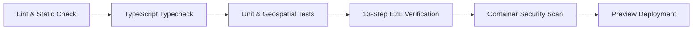

# AuraNER / NER-Route AI — Testing & Quality Assurance Strategy

## 1. Quality Engineering Vision

Logistics in India's Northeast Region carries mission-critical responsibilities: medical cold-chain delivery, disaster relief convoys, and driver safety on cliffside highways. Software failures or incorrect route recommendations can strand vehicles in active hazard zones.

The testing strategy establishes a zero-regression, multi-tier testing pyramid covering geospatial accuracy, algorithmic convergence, offline synchronization resilience, and enterprise security.

```
                   ▲
                  / \
                 /E2E\      End-to-End Operational Workflow (13 Steps)
                /-----\
               / Inte- \    API Contracts, PostGIS Spatial, OR-Tools Solvers
              / gration \
             /-----------\
            /  Unit Tests \  Domain Math, Circuit Breakers, Zod/Pydantic Validation
           /---------------\
```

---

## 2. Test Types & Execution Matrix

| Test Level | Scope | Framework | Execution Frequency | Target SLA / Threshold |
| :--- | :--- | :--- | :--- | :--- |
| **Frontend Unit** | React components, UI state, formatters | Vitest + React Testing Library | Every PR | 100% pass, $> 80\%$ line coverage |
| **Backend Unit** | Business services, circuit breaker, math | Pytest + pytest-asyncio | Every PR | 100% pass, $> 85\%$ line coverage |
| **Geospatial Tests**| PostGIS spatial indexes, distance queries | Pytest + Testcontainers (PostGIS) | Nightly / PR | Precise coordinate tolerances ($< 5\text{m}$) |
| **Optimization Tests**| OR-Tools VRP solver convergence & constraints | Pytest Benchmark | Nightly | Solver termination within 2,500ms |
| **API Contract** | OpenAPI schema compliance, response envelopes | Schemathesis / Spectral | Every PR | 0 contract violations |
| **Mobile Offline**| Outbox queue, SQLite persistence, sync replay | Jest + Expo Test Runner | Every PR | Zero lost pings on reconnection |
| **End-to-End** | Complete 13-step dispatch & reroute pipeline | Vitest / Playwright | Every PR / Pre-Deploy | 100% pass (0 failures) |
| **Load & Stress** | High-throughput telemetry ingestion | Locust / k6 | Weekly / Staging | 10,000 pings/sec at P95 $< 100\text{ms}$ |

---

## 3. Detailed Testing Domains

### 3.1 Spatial & Geospatial Accuracy Testing
- **Proximity Alerts (`ST_DWithin`)**: Verify that hazard proximity triggers fire accurately at $< 5.0\text{ km}$ buffer boundaries and suppress alerts at $\ge 5.1\text{ km}$.
- **Terrain Gradient Calculation**: Validate that road segment incline gradients are mathematically verified using digital elevation models (DEM) and that vehicles with `max_gradient_pct < slope` are correctly disqualified.
- **Coordinate Transformations**: Ensure WGS 84 (`EPSG:4326`) and Web Mercator (`EPSG:3857`) projections maintain high precision without floating-point drift.

### 3.2 OR-Tools Solver & Route Engine Benchmarking
- **Feasibility Verification**: Ensure vehicle payload capacity and volume constraints are never violated under any permutation of cargo items.
- **Mountain Detour Feasibility**: Test scenarios where primary mountain arteries (e.g. NH-29 at Zubza) are blocked by simulated landslides; verify that the alternative detour generated avoids the blocked polygon completely.
- **Timeout & Graceful Degradation**: Ensure that if the solver hits the time limit (e.g. 3.0 seconds), it returns the best-found heuristic solution rather than failing the HTTP request.

### 3.3 Mobile Offline & Network Chaos Testing
- **Airplane Mode Simulation**: Queue 50 GPS pings and 2 incident reports while offline; simulate reconnect and verify atomic, ordered upload.
- **Idempotency Testing**: Re-transmit identical telemetry packets with identical client UUIDs; verify that the backend deduplicates and writes exactly one position record.
- **Battery & Background Throttling**: Verify that background GPS tracking operates continuously for $> 8\text{ hours}$ without exceeding mobile OS battery caps.

### 3.4 Automated 13-Step Verification Scenario
The platform maintains an automated end-to-end operational verification scenario (`src/lib/test/scenario.ts` and `src/lib/test/scenario.test.ts`) executing the complete logistics lifecycle:
1. **Origin Search**: Nominatim + NER index location resolution.
2. **Destination Search**: Elevation and road quality verification.
3. **Cargo Specification**: Weight, volume, cold-chain parameters.
4. **AI Fleet Recommendation**: Gradient and payload matching.
5. **Route Topology Planning**: OSRM road geometry extraction.
6. **Meteorological Overlay**: Open-Meteo live weather sampling.
7. **Composite Risk Assessment**: Hazard scoring ($0-100$).
8. **Shipment Lifecycle Creation**: Creation of initial tracked record.
9. **Dispatch Execution**: Vehicle & driver binding, notification dispatch.
10. **Telemetry Ingestion**: Real-time GPS coordinate advance.
11. **Hazard Proximity Alert**: Proximity detection ($< 5\text{ km}$).
12. **Emergency Detour Recalculation**: Route recalculation around hazard block.
13. **Safe Haven Discovery & Audit**: Immutable audit logging and nearest police/clinic discovery.

---

## 4. Test Environments & Mock Data Strategy

### 4.1 Strict Separation of Mock vs Real Providers
- **Production Mode**: Mock providers are strictly disabled (`ALLOW_MOCK_PROVIDERS=false`). Real enterprise keys for NextBillion, Tomorrow.io, and Firebase are enforced.
- **Development & CI Mode**: Unit tests run against deterministic mock adapters and synthetic geo-fixtures without incurring third-party API costs or requiring external network access.
- **PostgreSQL Testcontainers**: Integration tests spin up ephemeral Docker containers containing real PostgreSQL 16 + PostGIS 3.4 instances to test raw SQL spatial queries.

---

## 5. Continuous Integration (CI) Pipeline

GitHub Actions pipeline triggers on all pull requests to `main` and `develop`:

Any failure at any stage immediately halts deployment and notifies the engineering team.
